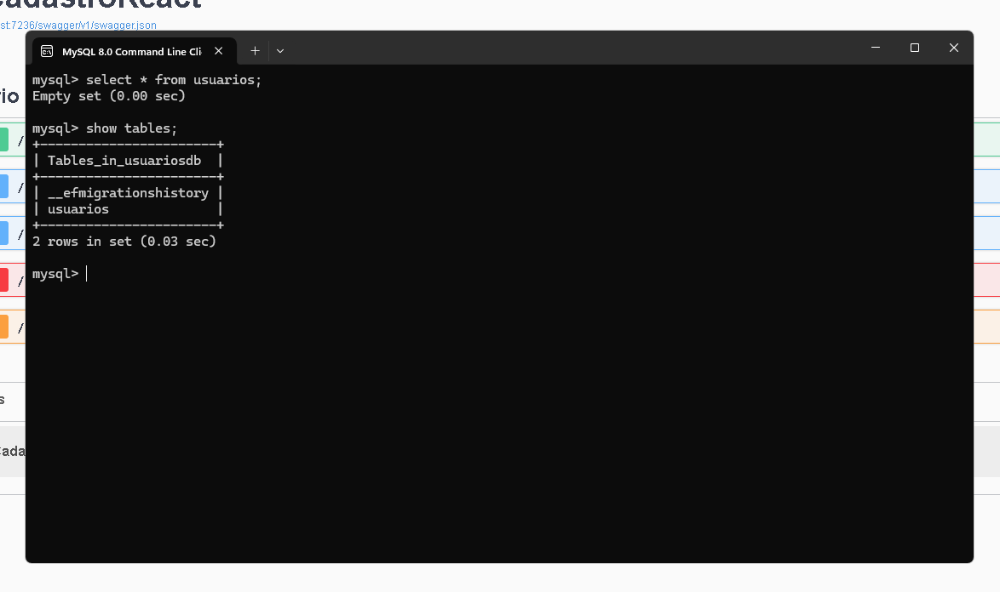
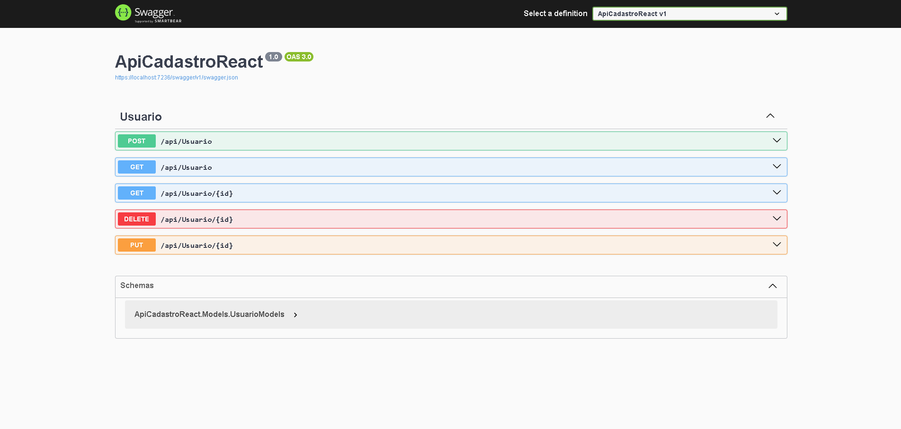

<h1>Cadastro de Usuários - Fullstack (React + ASP.NET Core)</h1>

 
 
Visão Geral
Projeto fullstack para cadastro de usuários com:

Frontend: React.js (Vite)

Backend: ASP.NET Core API

Banco de dados: MySQL (via Entity Framework Core)

Permite: 
        ✅Criar, 
        ✅Listar,
        ✅Remover usuários com validações em tempo real, inclusive para email's repetidos usando <strong>unique()</strong> no backend.

<h3>Tecnologias Utilizadas</h3>

<h1>Backend</h1>Frontend

✅ React.js
✅ Axios (para requisições HTTP)
✅ SweetAlert2 (notificações)
✅ Vite (build tool)

<h1>Backend</h1>

✅ ASP.NET Core 8
✅ Entity Framework Core

MySQL:

  

Swagger (documentação de API):

  

